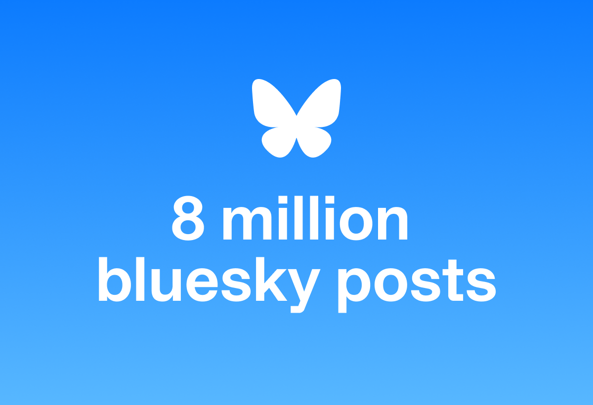

# Dataset Metadata

## Languages
- English (primary)
- Multilingual support

## License
MIT

## Tags
- bluesky
- social-media
- posts

## Dataset Features

| Feature | Type |
|---------|------|
| text | string |
| created_at | string |
| author | string |
| uri | string |
| has_images | boolean |
| reply_to | string |

## Dataset Configuration
- **Config Name**: default
- **Split**: train
- **Number of Examples**: 7,877,660

# 8 Million Bluesky Social Posts Collection

I've collected and curated 8 million public posts from Bluesky Social between November 27 - December 1, 2024, with an additional 12 million posts coming in the upcoming weeks. This growing dataset aims to provide researchers and developers with a comprehensive sample of real world social media data for analysis and experimentation. This collection represents one of the largest publicly available Bluesky datasets, offering unique insights into social media interactions and content patterns.

## Dataset Overview

### Key Information
- **Source**: Bluesky Social Platform
- **Time Range**: Nov 27 - Dec 1, 2024
- **Format**: JSONL
- **Curator**: Alim Maasoglu
- **Primary Language**: English (includes other languages)

### Data Structure
Each post entry contains:
- `uri`: Unique post identifier
- `created_at`: Post creation timestamp
- `text`: Post content
- `author`: Author information
- Additional metadata (images, replies, etc.)

### Potential Applications
- Social media content analysis
- Language processing research
- Trend analysis
- Content recommendation systems
- Social network analysis

### File Organization
- Files are chronologically organized
- Each file is approximately 140MB
- Naming format: `posts_[DATE]_[TIME].jsonl`

## Usage Notes
This dataset is intended for research and development purposes. Users should comply with Bluesky's terms of service when utilizing this data.

## Acknowledgments
Data collected from Bluesky Social's public posts. Special thanks to the Bluesky community.
